 <div align="center">
<h1>Reservation Restaurants</h1>

<br>
<p>Reservation restaurants is a web application that allows you to make restaurant reservations in an easy and simple way.
</p>
</div>

### Clone the repository
```shell
git clone git@github.com:CristianDavidVB/reservationsv2.git

cd reservationsv2
```
### Check your Ruby version
```shell
ruby -v
```
The output should start with something like ruby 3.2.2

If not, install the right ruby version using [rbenv](https://github.com/rbenv/rbenv) (it could take a while):

```shell
rbenv install 3.2.2
```

### Install dependencies
Using Bundler:
```shell
bundle install
```
### Set environment variables
Using dotenv:

an .env file is created in the project's main folder

The following is added to the .env file so that it works together with the ENV we have in config/database.yml


### Essential configuration for mailers

you must also fill in these empty fields with an email address with the gmail domain.

to generate the password need to generate a password for third party applications. The following video will be a good guide to generate it.

https://www.youtube.com/watch?v=Q74nxFBCHCI 


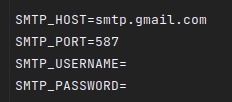

### Docker

[docker](https://www.docker.com/) you must modify the words between <>
```shell
docker run -- <here is the container name>  -e POSTGRES_PASSWORD=<YOUR PASSWORD> -p <other number>:5432 -d postgres:14
```
### Initialize the database
```shell
rails db:create db:migrate db:seed
```

## Functionality

### Project underway!
Once we are inside the project, we can execute the following command to start our application.

Terminal

```shell
rails s
```
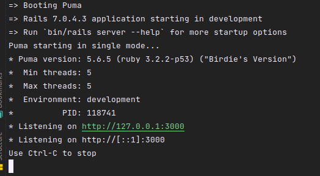

Perfect! Once our server is running, we will now use our preferred tool to help us make HTTP requests to our API. 

In my case I will use [Postman](https://www.postman.com/).

<div align="center">

</div>

We go to new to make the HTTP request

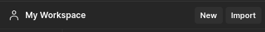

HTTP request


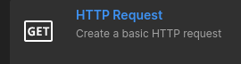


Now we enter the route to make a GET request, for good practices I decided to make a versioning < v1 > of the application in case in the future I decide to add more modules.

```shell
http://localhost:3000/api/v1/restaurants
```

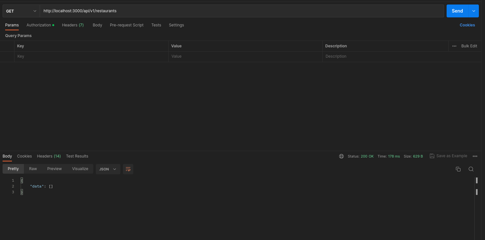

perfect in our api any customer can see the restaurants without the need of authentication.

But what if we want to create a restaurant without authentication?

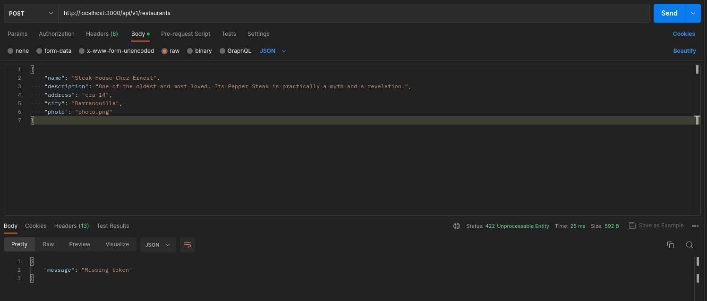

Great, validations for our API.

Now to generate our token we must write the following path.

```shell
localhost:3000/auth/login
```

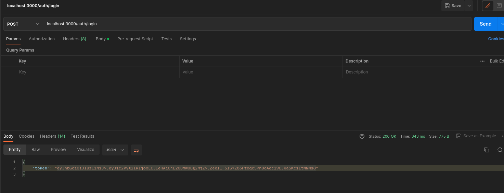

Once we obtain our token we will enter it in:

- 1: Authorization
- 2: Bearer Token
- 3: Paste the token

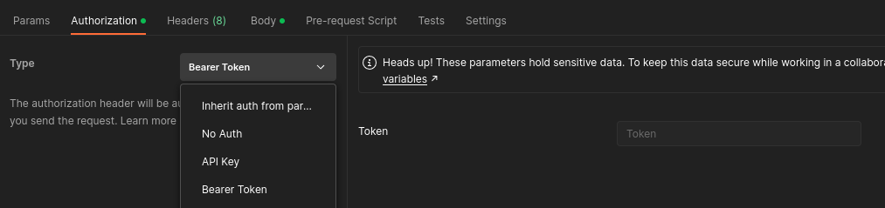

Once we have the token we can now create a new restaurant in the database.


One of the requirements of this application is to filter by the name of the city or by the name of the restaurant, let's see if it works.

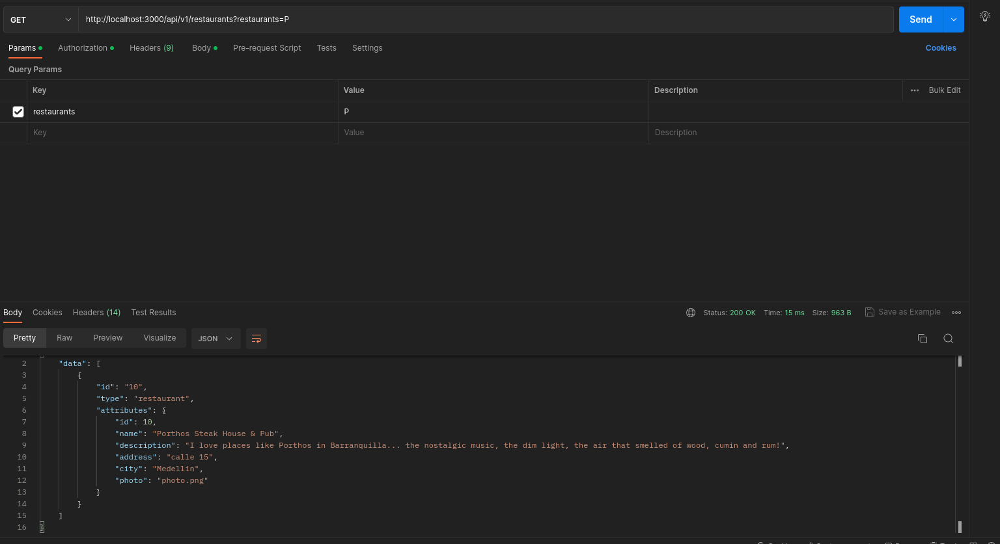

Perfect! It works, Perfect! It works, now for the city

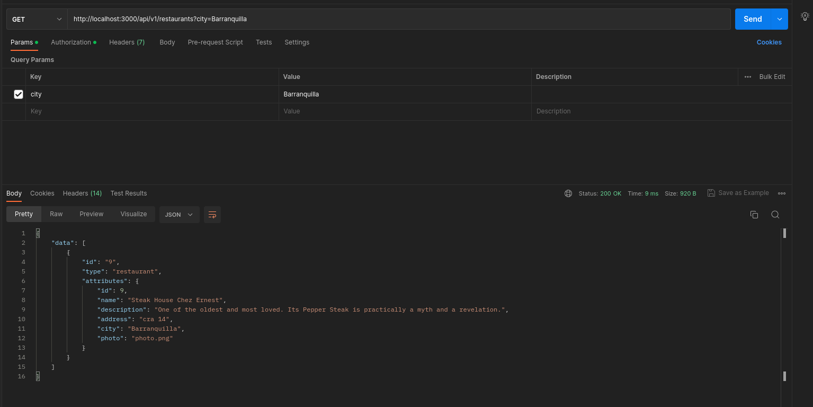

Now let's go for the reserves

A person cannot see the reservations unless he/she is authenticated.

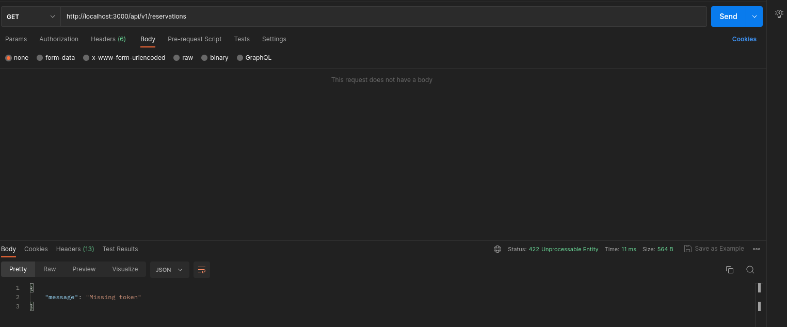

Now let's create a reservation


There are several reservation requirements:


1) when a reservation is made send an email about the reservation to the customer.

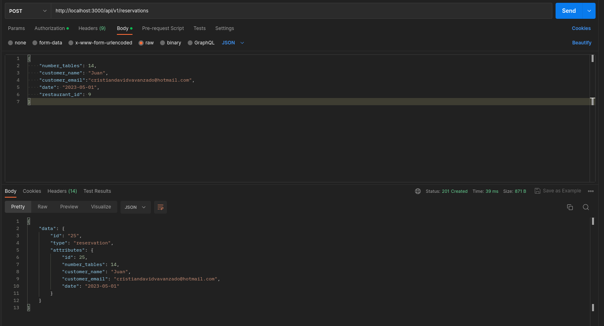

Email received

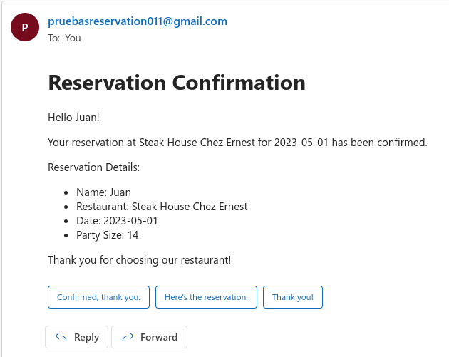

2)  15 reservations can be made per day per restaurant

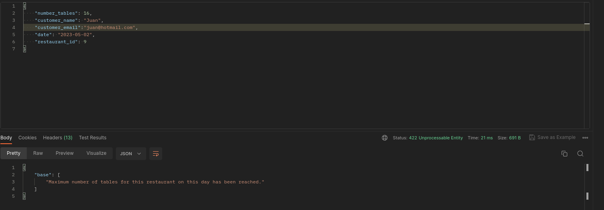

3) No more than 20 reservations should be allowed for a single day across all restaurants


As a good practice we should make sure that our code works by performing our tests, so we guarantee that our work is well done.

The tests are of:

models, controllers, request and auth. They are in the path app/spec 

Terminal

```shell
budle exec rspec
```

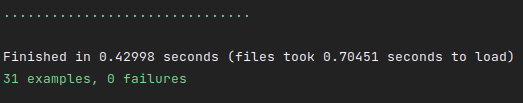
