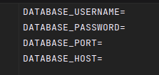

 <div align="center">
<h1>Reservation Restaurants</h1>

<br>
<p>Reservation restaurants is a web application that allows you to make restaurant reservations in an easy and simple way.
</p>
</div>

### Clone the repository
```shell
git clone git@github.com:CristianDavidVB/reservations-restaurants.git

cd reservations-restaurants
```
### Check your Ruby version
```shell
ruby -v
```
The ouput should start with something like ruby 3.2.2

If not, install the right ruby version using [rbenv](https://github.com/rbenv/rbenv) (it could take a while):

```shell
rbenv install 3.2.2
```

### Install dependencies
Using Bundler:
```shell
bundle install
```
### Set environment variables
Using dotenv:

an .env file is created in the project's main folder

The following is added to the .env file so that it works together with the ENV we have in config/database.yml



### Docker

[docker](https://www.docker.com/) you must modify the words between <>
```shell
docker run -- <here is the container name>  -e POSTGRES_PASSWORD=<YOUR PASSWORD> -p <other number>:5432 -d postgres:14
```
### Initialize the database
```shell
rails db:create db:migrate db:seed


la pagina sea como una especie de catalogo de restaurantes, que tenga un menu de navegacion que tenga todas las caracteristicas, foto, nombre, etc, etc todos los campos
que arriba del catalogo que tengo un filtro ciudad o nombre de restaurant, cuando le de click a un restaurante que me muestren las mesas y las que quiero reservar. 

# reservationes
# reservationsv2
